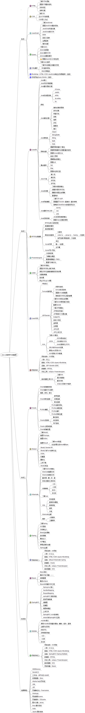

## 说明:
1. 当前内容中的图片,只是为了作示例说明用的.后续会修改.

---

## Java 程序员之路:
- 技能树:
    - [必备技能树](./00_skill_tree.md)
- 学习资源:
    - [官方资源列表]()
    - [必读书单]()
    - [优秀博客推荐]()
    - [github项目推荐]()

## Java工程师学习路线图
- 思维导图  
 
