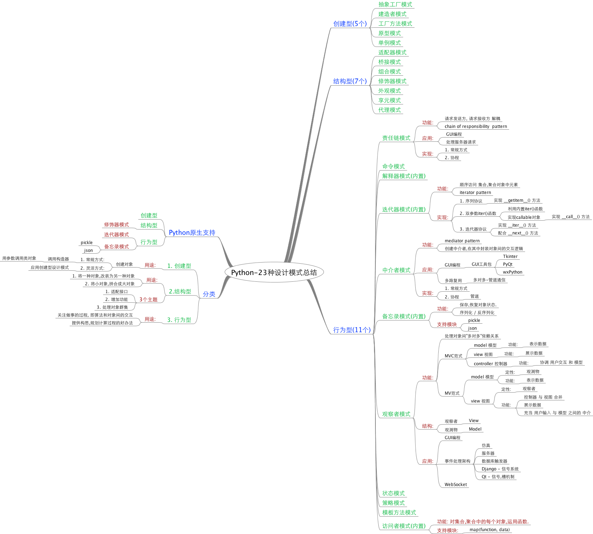

## 说明:
1. 当前内容中的图片,只是为了作示例说明用的.后续会修改.

---

## Python 程序员之路:
- 技能树:
    - [必备技能树](./00_skill_tree.md)
- 学习资源:
    - [官方资源列表](./00_python_std.md)
    - [必读书单](./01_book.md)
    - [优秀博客推荐](./02_blog.md)
    - [github项目推荐](./03_github.md)

## 重要内容:
    - [高阶语法]:
        - 生成器
        - 装饰器
        - 属性
    - [标准库]
        - os
        - os.path
        - sqlite
        - string
        - ...
    - [第三方库]
        - json
        - requests
        - urllib, urllib2
        - ...
    - [设计模式]
        - 

### 23种设计模式:

- 思维导图:

